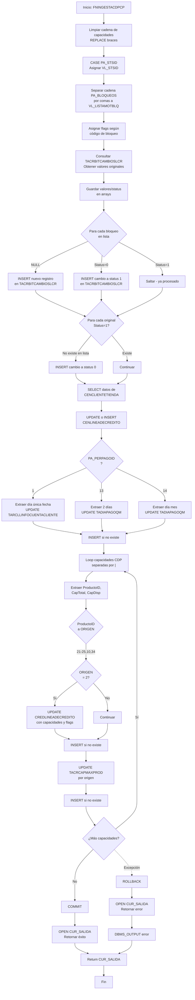

# Diagrama de Flujo: FNINGESTACDPCP

```mermaid
flowchart TD
    A["Inicio: FNINGESTACDPCP"] --> B["Limpiar cadena de capacidades<br>REPLACE braces"]
    B --> C["CASE PA_STSID<br>Asignar VL_STSID"]
    C --> D["Separar cadena PA_BLOQUEOS<br>por comas a VL_LISTAMOTBLQ"]
    D --> E["Asignar flags según<br>código de bloqueo"]
    E --> F["Consultar TACRBITCAMBIOSLCR<br>Obtener valores originales"]
    F --> G["Guardar valores/status<br>en arrays"]
    G --> H{Para cada bloqueo<br>en lista}
    H -->|NULL| I["INSERT nuevo registro<br>en TACRBITCAMBIOSLCR"]
    H -->|Status=0| J["INSERT cambio a status 1<br>en TACRBITCAMBIOSLCR"]
    H -->|Status=1| K["Saltar - ya procesado"]
    I --> L{Para cada original<br>Status=1?}
    J --> L
    K --> L
    L -->|No existe en lista| M["INSERT cambio a status 0"]
    L -->|Existe| N["Continuar"]
    M --> O["SELECT datos de<br>CENCLIENTETIENDA"]
    N --> O
    O --> P["UPDATE o INSERT<br>CENLINEADECREDITO"]
    P --> Q{PA_PERPAGOID<br>?}
    Q -->|1| R["Extraer día única fecha<br>UPDATE TARCLLINFOCUENTACLIENTE"]
    Q -->|13| S["Extraer 2 días<br>UPDATE TADIAPAGOQM"]
    Q -->|14| T["Extraer día mes<br>UPDATE TADIAPAGOQM"]
    R --> U["INSERT si no existe"]
    S --> U
    T --> U
    U --> V["Loop capacidades CDP<br>separadas por |"]
    V --> W["Extraer ProductoID,<br>CapTotal, CapDisp"]
    W --> X{ProductoID<br>a ORIGEN}
    X -->|21-25,10,34| Y{ORIGEN<br>= 2?}
    Y -->|Sí| Z["UPDATE CREDLINEADECREDITO<br>con capacidades y flags"]
    Y -->|No| AA["Continuar"]
    Z --> AB["INSERT si no existe"]
    AA --> AB
    AB --> AC["UPDATE TACRCAPMAXPROD<br>por origen"]
    AC --> AD["INSERT si no existe"]
    AD --> AE{¿Más capacidades?}
    AE -->|Sí| V
    AE -->|No| AF["COMMIT"]
    AF --> AG["OPEN CUR_SALIDA<br>Retornar éxito"]
    AG --> AH["Return CUR_SALIDA"]
    AH --> AI["Fin"]
    AE -.->|Excepción| AJ["ROLLBACK"]
    AJ --> AK["OPEN CUR_SALIDA<br>Retornar error"]
    AK --> AL["DBMS_OUTPUT error"]
    AL --> AH
```
